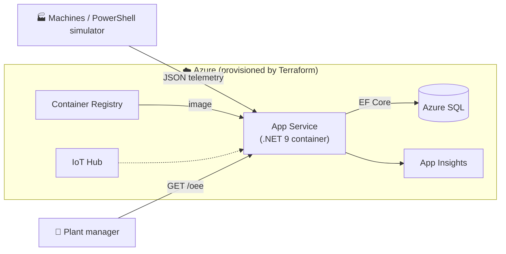

# 🏭 Factory Telemetry & OEE Monitor

> A lightweight, cloud-native backend that ingests telemetry from production machines
> (e.g. a robotic welding cell) and computes **OEE — Overall Equipment Effectiveness**,
> the headline KPI of every manufacturing plant.

[](https://github.com/dawidbis/IoT_Production_Monitor/actions/workflows/ci.yml)


This is a **DevOps portfolio project**. The application is deliberately small so the
*engineering around it* — Infrastructure-as-Code, CI/CD, scripting, and testing — is the star.
It demonstrates the exact stack used in a modern Microsoft-cloud manufacturing-IT team.

---

## ✨ What it does

1. **Ingests** JSON telemetry from machines: `{ "machineId": "WELD-CELL-07", "state": "Running", "temperatureC": 72, "partsProduced": 12, "partsRejected": 1 }`
2. **Persists** it to Azure SQL (or an in-memory DB locally).
3. **Computes OEE** on demand: `OEE = Availability × Performance × Quality`.

```bash
GET /api/machines/WELD-CELL-07/oee
→ { "availability": 0.75, "performance": 1.0, "quality": 0.95, "oee": 0.7125, "oeePercent": 71.3 }
```

## 🧱 Technology stack — by layer

| Layer | Technology | Where |
| --- | --- | --- |
| **1 · Infrastructure (IaC)** | Terraform (HCL), AzureRM provider → App Service, Azure SQL, IoT Hub, ACR, App Insights | [`infra/`](infra) |
| **2 · CI/CD** | Azure Pipelines (YAML), multi-stage, container build & deploy | [`pipelines/`](pipelines) |
| **3 · Scripting** | PowerShell 7, Pester (tests), PSScriptAnalyzer (lint) | [`scripts/`](scripts) |
| **4 · Application** | C# / .NET 9 Minimal API, EF Core, Serilog, Swagger | [`src/`](src), [`tests/`](tests) |
| **5 · Product mgmt & docs** | Markdown backlog (Azure Boards style), architecture & runbook | [`docs/`](docs) |

## 🚀 Quickstart

### Operator console (recommended)

```powershell
# Interactive menu: health, simulate telemetry, OEE report, live monitor, switch Azure/Local
.\FactoryTelemetry.bat                 # or:  ./scripts/Start-FactoryConsole.ps1
```

The console targets the deployed **Azure** app by default (configured in
[`scripts/FactoryTelemetry.config.psd1`](scripts/FactoryTelemetry.config.psd1)); switch to
**Local** from the menu or with `-Target Local`.

Menu option **`[9] Zarzadzanie Azure`** drives the live cloud environment end to end —
provision the infrastructure (`terraform apply`), deploy the app, start/stop the Web App,
or **destroy everything** (`terraform destroy`) to stop consuming Azure credits. It needs
`az` (logged in via `az login`) and `terraform` on `PATH`.

### Local API (zero infrastructure)

```powershell
# 1. Run the API (uses an in-memory database automatically)
dotnet run --project src/FactoryTelemetry.Api
#    → Swagger UI at http://localhost:5150/swagger

# 2. Stream telemetry + read OEE against the local instance
./scripts/New-SampleTelemetry.ps1 -BaseUrl http://localhost:5150 -Count 30
./scripts/Get-OeeReport.ps1        -BaseUrl http://localhost:5150
```

## ✅ Tests & quality gates

```powershell
dotnet test                            # 11 tests: OEE unit tests + API integration tests
./scripts/Invoke-StaticAnalysis.ps1    # PSScriptAnalyzer (lint) + 15 Pester tests
```

Both run automatically in CI on every pull request — together with `terraform fmt -check`
and `terraform validate`.

## 🏗️ Architecture



Full diagrams and request flows in [`docs/architecture.md`](docs/architecture.md).
The OEE maths is documented in [`docs/oee-calculation.md`](docs/oee-calculation.md).

## 📁 Repository layout

```
.
├── src/FactoryTelemetry.Api/     # .NET 9 Minimal API (models, EF Core, OEE calculator)
├── tests/FactoryTelemetry.Tests/ # xUnit unit + integration tests
├── infra/                        # Terraform IaC for all Azure resources
├── pipelines/                    # Azure Pipelines (multi-stage CI/CD) + templates
├── scripts/                      # PowerShell module, simulator, quality-gate + Pester tests
├── docs/                         # Architecture, OEE, product backlog, runbook
└── FactoryTelemetry.sln
```

## ☁️ Deploy to Azure

The complete flow — *Terraform provision → container build & push → App Service deploy →
`/health` smoke test* — is defined in [`pipelines/azure-pipelines.yml`](pipelines/azure-pipelines.yml).
For manual steps see [`infra/README.md`](infra/README.md) and [`docs/runbook.md`](docs/runbook.md).

### Bring it online / tear it down (cost control)

The whole Azure lifecycle is driveable from the operator console — menu option
**`[9] Zarzadzanie Azure`** — so demos don't need any memorised commands:

| Action | Console option | Under the hood |
| --- | --- | --- |
| Provision + deploy | `[1]` (offers `[2]` after) | `terraform apply` → `az webapp deploy` |
| Resume the app | `[3]` | `az webapp start` |
| Pause the app | `[4]` | `az webapp stop` *(plan still bills)* |
| Free all credits | `[5]` | `terraform destroy` |

The Terraform **remote state** lives in its own, near-free storage account (resource
group `rg-tfstate`), kept separate from the workload. You can therefore `destroy` the
billable resources between demos and re-provision later **without re-bootstrapping the
backend** — the console captures the freshly-minted URL and writes it back into
[`scripts/FactoryTelemetry.config.psd1`](scripts/FactoryTelemetry.config.psd1).
Requires `az login` and `terraform` on `PATH`.

## 📌 Context

Built as a portfolio piece for a **DevOps / Cloud (Azure) internship**, modelled on a real
manufacturing scenario: telemetry from automated production cells, on the Microsoft cloud
stack (Azure + Terraform + Azure DevOps + .NET + PowerShell).

---

<sub>MIT licensed · see [LICENSE](LICENSE)</sub>
