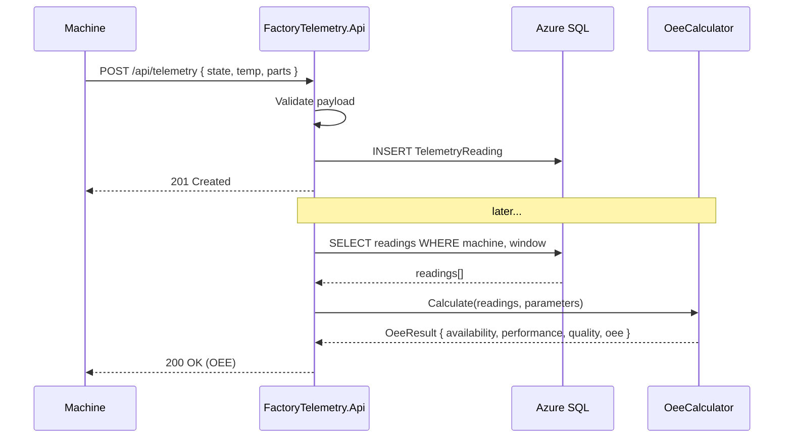

# Architecture

The **Factory Telemetry & OEE Monitor** is a lightweight backend that ingests machine
telemetry from the shop floor, persists it, and computes **Overall Equipment Effectiveness
(OEE)** — the headline KPI of every manufacturing plant.

It is built as a DevOps showcase: the application itself is deliberately small so that the
*automation around it* (Infrastructure-as-Code, CI/CD, scripting, testing) takes centre stage.

## System context

```mermaid
flowchart LR
    subgraph Plant["🏭 Shop floor (ZF welding cell / press)"]
        M["Machines / PLCs"]
        SIM["PowerShell simulator\nNew-SampleTelemetry.ps1"]
    end

    subgraph Azure["☁️ Microsoft Azure"]
        IOT["Azure IoT Hub\n(cloud gateway)"]
        APP["Azure App Service\n(Linux container)\nFactoryTelemetry.Api"]
        SQL[("Azure SQL Database")]
        AI["Application Insights"]
        ACR["Container Registry"]
    end

    OPS["👷 Plant manager / dashboard"]

    M -->|JSON telemetry| IOT
    SIM -->|HTTP POST /api/telemetry| APP
    IOT -.->|routing| APP
    APP -->|EF Core| SQL
    APP -->|traces / metrics| AI
    ACR -->|image pull| APP
    OPS -->|GET /api/machines/{id}/oee| APP
```

## Layers

| # | Layer | Tech | Folder |
| --- | --- | --- | --- |
| 1 | Infrastructure (IaC) | Terraform / HCL, AzureRM provider | [`infra/`](../infra) |
| 2 | CI/CD | Azure Pipelines (YAML) | [`pipelines/`](../pipelines) |
| 3 | Scripting | PowerShell 7, Pester, PSScriptAnalyzer | [`scripts/`](../scripts) |
| 4 | Application | C# / .NET 9, EF Core, Serilog | [`src/`](../src), [`tests/`](../tests) |
| 5 | Product mgmt & docs | Markdown / Azure Boards & Wiki | [`docs/`](.) |

## Request flow (ingestion → OEE)



## Key design decisions

- **Pluggable persistence.** The API uses Azure SQL in the cloud but transparently falls
  back to EF Core's in-memory provider when no connection string is present, so it runs
  locally and in CI with zero infrastructure.
- **Domain logic isolated & tested.** `OeeCalculator` is a pure, dependency-free class — the
  OEE formula is fully covered by unit tests, independent of HTTP or the database.
- **Container-first deployment.** The app ships as a container pulled from ACR by the App
  Service using a managed identity (no stored registry credentials).
- **Everything reproducible.** Infrastructure is declared in Terraform; the entire
  build → provision → release flow is one Azure Pipeline.

See [oee-calculation.md](oee-calculation.md) for the maths and [runbook.md](runbook.md) for operations.
